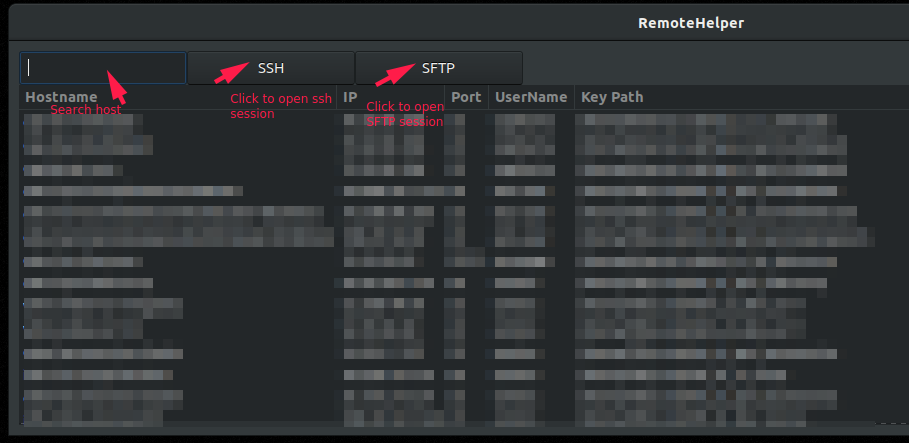

# Overview

I Work with Ansible and my file `./ssh/config` has the connection data to all the serves that I manage, this tool reads
that file and show a grid with all the hosts and give the possibility to stablish a SSH session using xfce4-terminal and
a SFTP session using Filezilla by clicking in a button.

# Install

The installer will create a directory in `$HOME/bin` and then a symlink to the script, if you `$PATH` include the
directory `$HOME/bin` you will be able to run the helper using the command `remotehelper`

```
sudo apt install xfce4-terminal
chmod 755 installer.sh && ./installer.sh
```

# Configuration

- Every entry in `./ssh/config` need this fields: HostName, Port, IdentityFile and User. The option Host is used for filtering.
- The first time you open a SFTP session you need to add manually the key file `$HOME/.ssh/filezilla` in the option
`Edit` -> `Settings` -> `SFTP` of Filezilla. This key is a symlink to the key file associated with the current selected host.
Every time you select other host and click the button `SFTP` this symlink is updated
- If the data of `./ssh/config` is updated you need to restart the program to refresh the information

# Usage



# To-Do

- Allow resizing of the window
- Refresh information from `./ssh/config` using a button 

# Links

- https://python-gtk-3-tutorial.readthedocs.io/en/latest/index.html
- https://www.youtube.com/playlist?list=PL6gx4Cwl9DGBBnHFDEANbv9q8T4CONGZE